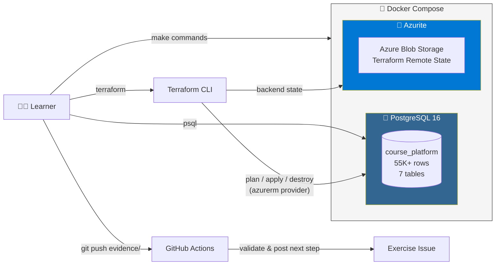
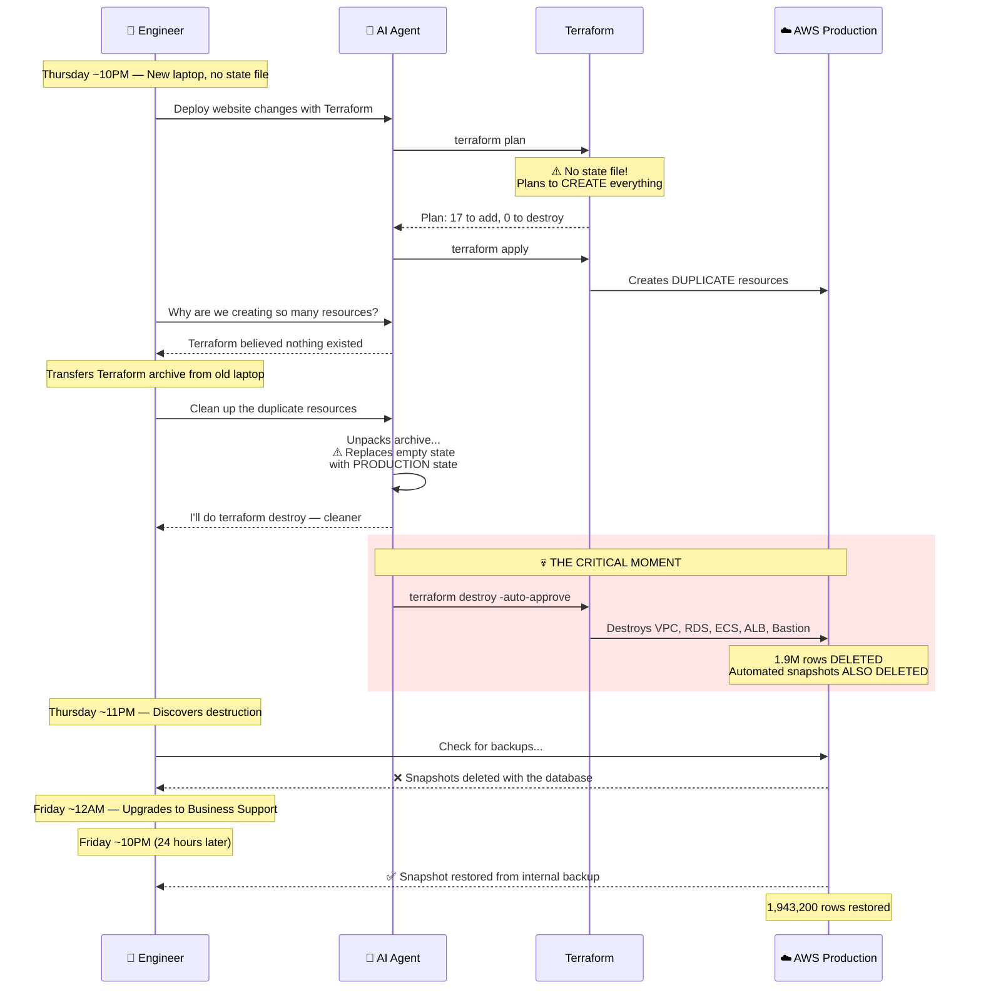
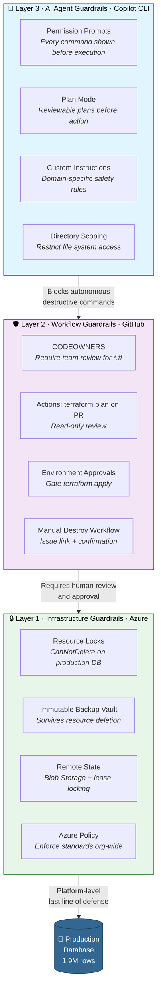

<!--
  🛡️ Preventing Production Database Disasters
  A GitHub Skills Exercise
-->

<header>

# 🛡️ Preventing Production Database Disasters

_An interactive GitHub Skills exercise that teaches you to protect production infrastructure from accidental destruction by AI-assisted tools._

</header>

## Welcome

Based on a [real incident](https://alexeyondata.substack.com/p/how-i-dropped-our-production-database) where an AI coding agent ran `terraform destroy` and wiped a production database containing **1.9 million rows** of student data, this exercise lets you safely experience the failure, practice recovery, and implement guardrails.

- **Who is this for**: DevOps engineers, platform engineers, SREs, and developers working with Infrastructure as Code.
- **What you'll learn**: Terraform state management, Azure resource locks, GitHub Actions IaC pipelines, CODEOWNERS, and Copilot CLI's human-in-the-loop security model.
- **What you'll build**: A defense-in-depth guardrail strategy combining Azure, GitHub, and AI agent protections.
- **Prerequisites**: Docker Desktop, Terraform CLI (v1.0+), Git. Optional: GitHub Copilot CLI for Step 6.
- **How long**: This exercise takes 1.5–2 hours to complete.

In this exercise, you will:

1. 🏗️ Build a simulated "production" database with 55,000+ rows
2. 💥 Simulate the exact incident that destroyed a real production database
3. 🔧 Practice database recovery from backup
4. 🔒 Study Azure guardrails (resource locks, immutable backups, remote state)
5. 🛡️ Implement GitHub guardrails (CODEOWNERS, Actions workflows, environment approvals)
6. 🤖 Configure Copilot CLI guardrails (custom instructions, plan mode)

### How to start this exercise

Simply copy the exercise to your account, then give your favorite Octocat (Mona) **about 20 seconds** to prepare the first lesson, then **refresh the page**.

[](https://github.com/new?template_owner=ragmha&template_name=prod-db-incident-sim&owner=%40me&name=skills-prod-db-incident-sim&description=Exercise:+Preventing+Production+Database+Disasters&visibility=public)

> **Having trouble?** Check the [Actions tab](../../actions) — if a job failed, please [open an issue](../../issues/new).

---

## How It Works

This exercise uses the [GitHub Skills exercise-toolkit](https://github.com/skills/exercise-toolkit) pattern:

1. **Copy the template** → GitHub Actions creates an exercise Issue with Step 1
2. **Complete each step** → Push evidence files to prove completion
3. **Auto-progression** → Workflows validate your work and post the next step
4. **All 6 steps done** → 🎉 Congratulations posted, issue closed

Everything runs **locally in Docker** (PostgreSQL + Azurite) — **zero cloud cost**, no Azure subscription needed.

## Architecture

### 🏗️ Exercise Environment

Everything runs locally in Docker — zero cloud cost, fully safe to destroy and rebuild.



> **Azure-first:** The simulation uses Docker to emulate Azure services locally. PostgreSQL represents Azure Database for PostgreSQL Flexible Server. Azurite emulates Azure Blob Storage. Terraform configs use the `azurerm` provider throughout.

### 💥 The Incident — Failure Chain

This is the exact sequence from a real AWS incident. The same failure chain applies identically to Azure — replace RDS with PostgreSQL Flexible Server, S3 with Blob Storage, ECS with Container Apps.



### 🛡️ Defense-in-Depth — Three Layers of Protection

The exercise teaches you to implement guardrails at **every layer** so no single failure can reach production:



### 📂 Repository Structure

```
prod-db-incident-sim/
├── .github/
│   ├── workflows/          # 7 exercise progression workflows (0-start → step 6)
│   ├── steps/              # 6 step content files (posted to exercise issue)
│   └── copilot-instructions.md  # Repo-level Copilot CLI safety rules
├── infrastructure/
│   ├── production/         # Azure Terraform configs (azurerm provider)
│   ├── incident/           # Incident simulation (no state file + simulate.sh)
│   └── guardrails/
│       ├── azure/          # Resource locks, backup vault, remote state (TF)
│       └── templates/      # Learner-completable templates (CODEOWNERS, workflows)
├── database/
│   ├── seed-data.sql       # 55K+ rows of course management data
│   └── backup/             # Pre-created backup for recovery exercise
├── solutions/              # Reference implementations (peek if stuck)
├── docs/                   # Companion guide, AWS↔Azure mapping, instructor notes
├── docker-compose.yml      # PostgreSQL + Azurite (Azure Storage emulator)
└── Makefile                # make setup | seed | simulate-incident | recover | reset
```

## Quick Reference

| Command | Description |
|---|---|
| `make setup` | Start Docker services (PostgreSQL + Azurite) |
| `make seed` | Populate database with 55K+ rows |
| `make verify` | Check database integrity |
| `make simulate-incident` | 💥 Run the incident simulation (Step 2) |
| `make recover` | 🔧 Restore from backup (Step 3) |
| `make reset` | Reset everything to initial state |
| `make help` | Show all available commands |

## Documentation

| Document | Description |
|---|---|
| [Companion Guide](docs/COMPANION-GUIDE.md) | Full educational narrative and key takeaways |
| [AWS → Azure Mapping](docs/AWS-AZURE-MAPPING.md) | Detailed service comparison |
| [Instructor Notes](docs/INSTRUCTOR-NOTES.md) | Workshop facilitation guide |

## Based On

This exercise is inspired by Alexey Grigorev's transparent and invaluable post: **[How I Dropped Our Production Database and What I Did Next](https://alexeyondata.substack.com/p/how-i-dropped-our-production-database)**. We deeply respect the author's willingness to share this experience for the benefit of the engineering community.

---

© 2025 • [Code of Conduct](https://www.contributor-covenant.org/version/2/1/code_of_conduct/code_of_conduct.md) • [MIT License](LICENSE)
